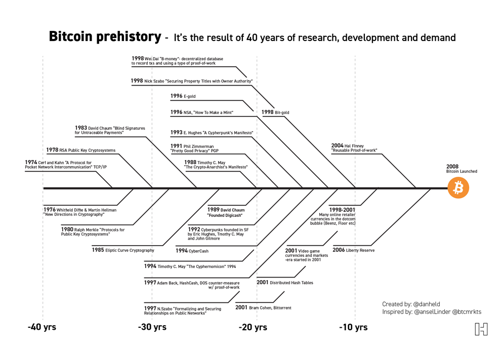

# About this book

This book will cover information for beginner and advanced users.
Before even think to buy some crypto "do your own research"! 
Most secure and with best return of investment cryptos are BTC and ETH. 
Other crypto coins are still not enough proved and with high investment risks!

This book will begin with main chapters:
- BTC
- BTC Lear 2 or Lightning Network
- ETH
- Altcoins
 

## What is BTC (Bitcoin)?

Bitcoin (₿) is a decentralized digital currency and digital store of value (SOV), without a central bank or single 
administrator, that can be sent from user to user on the peer-to-peer bitcoin network without the need for intermediaries.

Transactions are verified by network nodes through cryptography and recorded in a public distributed ledger called a blockchain. 
The cryptocurrency was invented in 2008 by an unknown person or group of people using the name Satoshi Nakamoto.
The currency began use in 2009 when its implementation was released as open-source software.

Bitcoins are created as a reward for a process known as mining. They can be exchanged for other currencies, products, 
and services. Bitcoin has been criticized for its use in illegal transactions, the large amount of electricity 
(and thus carbon footprint) used by mining, price volatility, and thefts from exchanges. 

Some investors and economists have characterized it as a speculative bubble at various times. Others have used it as an 
investment, although several regulatory agencies have issued investor alerts about bitcoin. 

In September 2021, El Salvador officially adopted Bitcoin as legal tender, becoming the first nation to do so.

The word bitcoin was defined in a [white paper](https://bitcoin.org/bitcoin.pdf) published on 31 October 2008. 

**read more historical details from source**: [wikipedia.org/wiki/Bitcoin](https://en.wikipedia.org/wiki/Bitcoin) 

### Bitcoin Prehistogram - prehistory

Most people think that Bitcoin was created in 2009, but story of Bitcoin is much bigger and it goes 40 years back in history.
We started back in long time ago year 1974 and important events are presented in above tree image presentation.
40 years of research, development and demand

source: [bitcointalk.org](https://bitcointalk.org/index.php?topic=5290162.0)

compare BTC with  other tech in past and adoption of:

source: [marketrealist.com](https://marketrealist.com/2015/12/adoption-rates-dizzying-heights/)


source: [twitter.com/BTC_Archive](https://twitter.com/BTC_Archive/status/1472595957296603149?s=20)


source: Deutsche Bank


## Why BTC is it so expensive?
BTC is limited to 21 million coins only.

**Notice**: In most centralized exchanges (CEX) like Coinbace/Biance/Kraken/Gemini/... you can buy BTC for minimum amount of $10 or more.
The market price is calculated by supply and demand. 

You must divide "Market Cap" by "Circulating Supply" and this will give you current price. 

Example: Market Cap	$863,535,393,452 / Circulating Supply 18,905,943 = $45 675,34


source chart: [coingecko.com/en/coins/bitcoin](https://www.coingecko.com/en/coins/bitcoin)

## BTC can be divided on small amounts
You can buy Satoshies (SATS) instead of one complete BTC. SATS are like pennies in US Dollar.

SATS are used for small transactions in BTC Layer 2 (BTC Lightning Network)
SAT In feature 1 satoshi can potentially be **1$** or more.
```
0.00000001 Bitcoin 1 Satoshi	        
0.00000010 Bitcoin 10 Satoshi	        
0.00000100 Bitcoin 100 Satoshi	        
0.00001000 Bitcoin 1,000 Satoshi       
0.00010000 Bitcoin 10,000 Satoshi      
0.00100000 Bitcoin 100,000 Satoshi     
0.01000000 Bitcoin 1,000,000 Satoshi	
0.10000000 Bitcoin 10,000,000 Satoshi	
1.00000000 Bitcoin 100,000,000 Satoshi	
```
To see current price of Satoshi(SATS) to USD Chart visit [tradingview.com](https://www.tradingview.com/symbols/SATSUSD/?exchange=INDEX)

This is convenient way to compare satoshies price with other altcoins like [Shiba Inu](https://www.tradingview.com/symbols/SHIBUSD/?exchange=FTX)
or [Dogecoin](https://www.tradingview.com/symbols/DOGEUSDT/?exchange=BINANCE).


### Bitcoin Balances on Exchanges
How much  BTC are left ot crypto market: 

for more detailed information visit: [coinglass.com/Balance](https://www.coinglass.com/Balance)


## How much  BTC and ETH are used in each moment, cool animated comparison in real time
This website show in real time how much transaction are processed and still in pending mode .

source:[txstreet.com](https://txstreet.com/v/eth-btc)

## BTC pros and cons
todo: in progress
Pros:
- good store of value
- Limited to 21 million coins only. Last BTC will be generated near the year 2140.
- Censorship resistant. The coins can be sent anywhere in the world through the internet without being blocked 24/7

Cons:
- Volatility


### BTC vs Gold