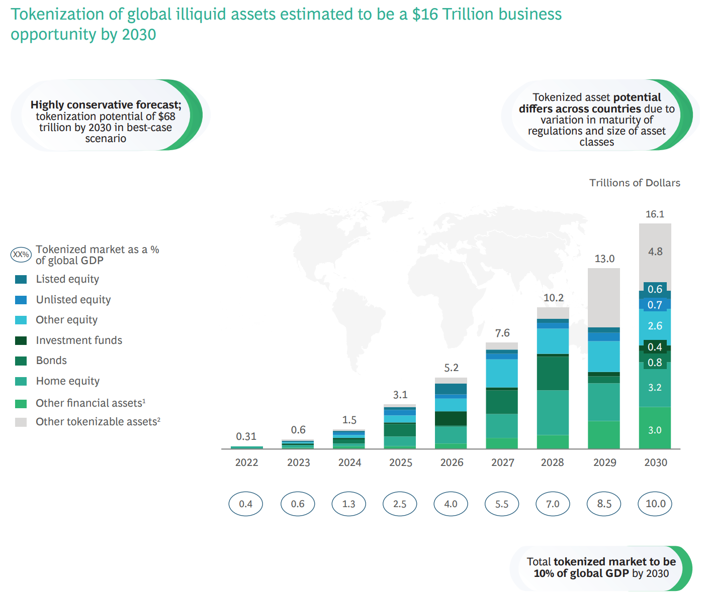
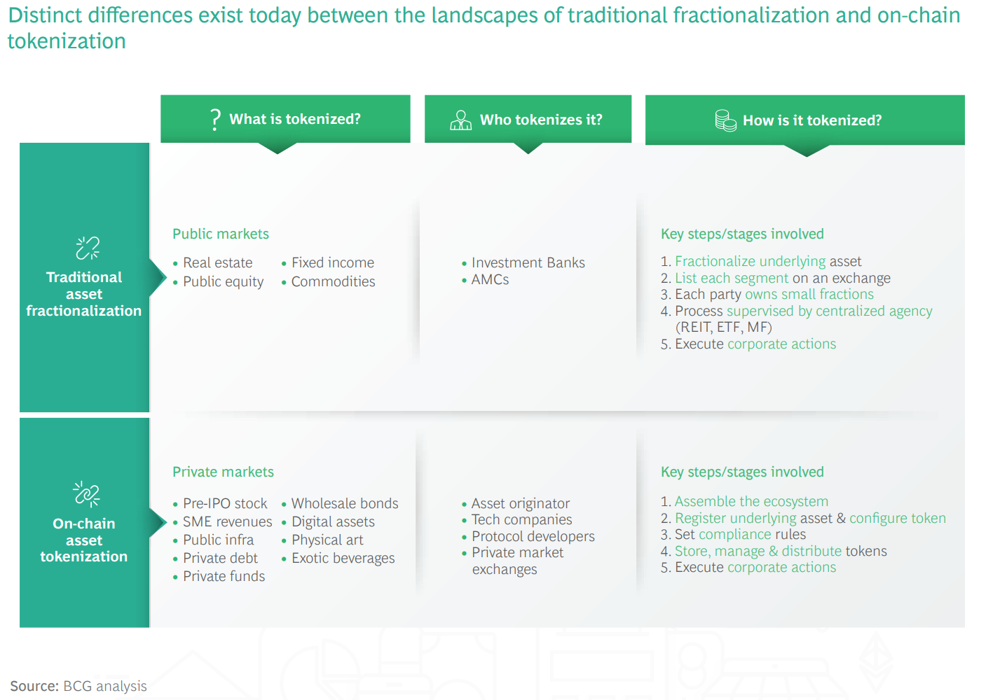
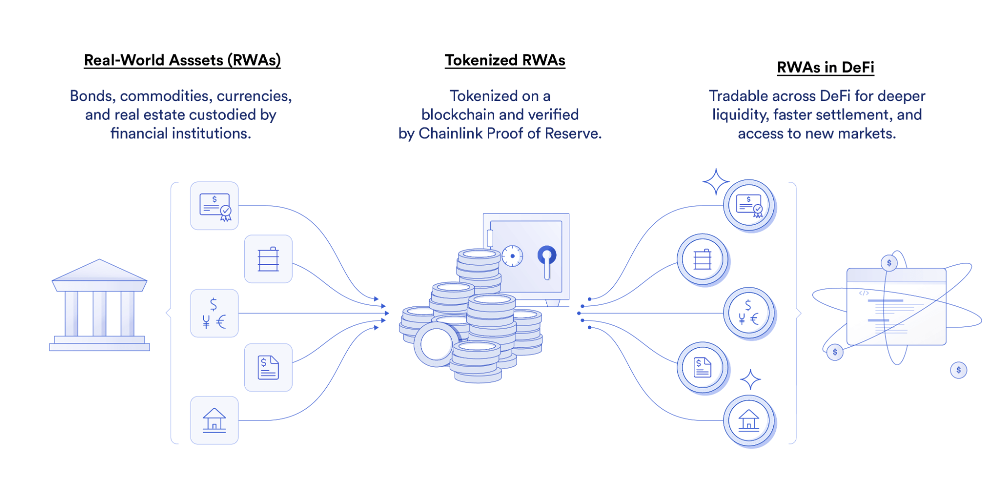

# Real-World Assets

Real-world assets (RWAs) in blockchain are digital tokens that represent physical and traditional financial assets, such as currencies, commodities, equities, and bonds. In theory, anything of value can be tokenized and brought onchain.

Asset tokenization involves representing the ownership rights of real-world assets as digital tokens stored on a blockchain.

According to a [report by Boston Consulting Group and ADDX](https://www.bcg.com/publications/2022/relevance-of-on-chain-asset-tokenization), the tokenization market is estimated to be a $16T business opportunity by 2030, setting the stage for a large-scale transformation to global economies underpinned by blockchain technology and cryptographic truth. 
[Link to PDF report](https://web-assets.bcg.com/1e/a2/5b5f2b7e42dfad2cb3113a291222/on-chain-asset-tokenization.pdf)

Distinct differences exist today between the landscapes of traditional fractionalization and on-chain
tokenization

## How Does Asset Tokenization Work?
The process of creating tokenized assets involves several steps—defining the token type (fungible or non-fungible), selecting the blockchain to issue the tokens on, selecting a third-party auditor to verify off-chain assets, issuing the assets, and more. 

source: [https://chain.link/education/asset-tokenization](https://chain.link/education/asset-tokenization)

## Select the Asset to Tokenize
The first step is to identify the asset that you want to tokenize. This could be equities, commodities, currencies, securities, fine art, carbon credits, intellectual property, or another asset class.

## Define Token Type
Once you’ve identified the asset you want to tokenize, you need to define the type of token that you want to create. You’ll need to consider factors such as the token standard you want to use (ERC-20, ERC-721, ERC-1155, etc.), the number of tokens to be created, the mechanism governing minting tokens, and other custom parameters and rulesets.

## Choose the Blockchain You Want to Issue Your Tokens On

- Ethereum and ChainLink
- [Algorand chain and RWA](https://www.algorand.foundation/news/what-are-real-world-assets-rwas)

## The Need for Oracles in Asset Tokenization and Proof of Reserve

- ChainLink: Tokenized asset projects can use a decentralized verification service, Chainlink Proof of Reserve, to help relay this off-chain data on-chain. Chainlink PoR provides unparalleled transparency into off-chain collateral, helping enhance the security and verifiability of tokenized assets.